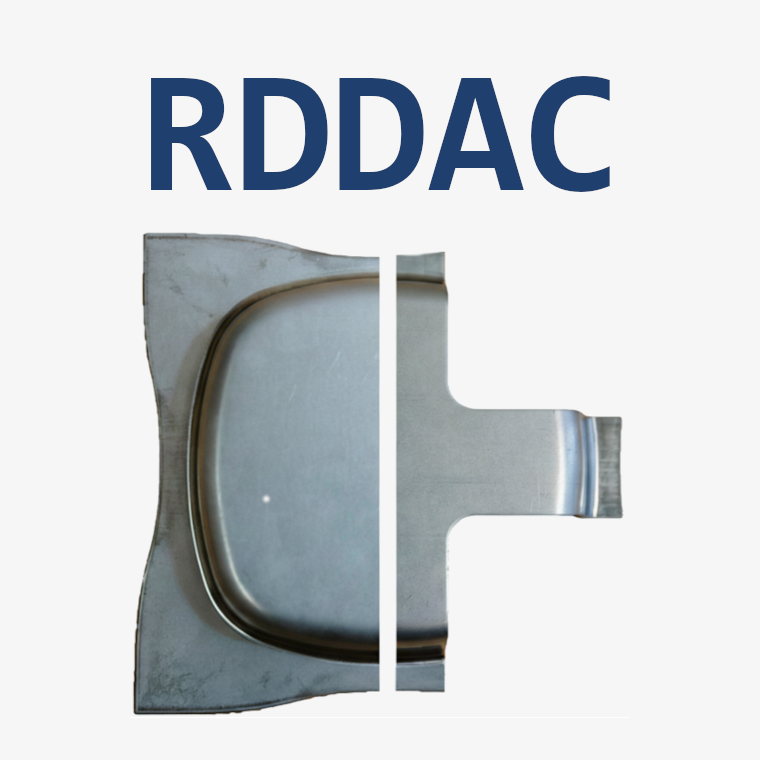
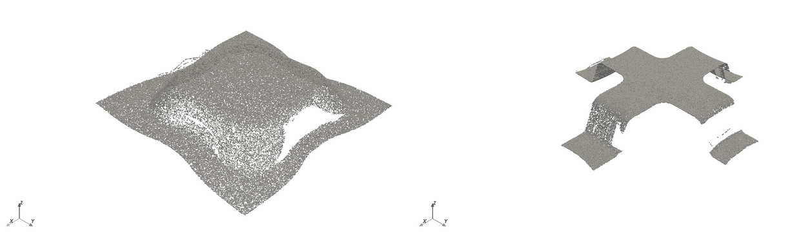

# RDDAC

<div align="center">
  
</div>

[](https://creativecommons.org/licenses/by/4.0/)
[](https://github.com/BaumSebastian/RDDAC/blob/main/LICENSE)
[](https://www.python.org/downloads/)
[](https://darus.uni-stuttgart.de/dataset.xhtml?persistentId=doi:10.18419/DARUS-5589)
[](https://doi.org/10.18419/DARUS-5589)

<div align="center">
  
  <p><em>Measured point clouds of one experiment after OP10 (left) and OP20 (right), colored by the deviation from the matching DDACS simulation.</em></p>
</div>

**A large-scale experimental dataset of {{ experiment_count() }} physical deep-drawing and cutting experiments — the real-world counterpart to the [DDACS](https://ddacs.readthedocs.io) FEM simulations.** Each experiment forms a modified quadratic cup from DP600 dual-phase steel (deep drawing in OP10, cutting in OP20) and records press force signals, sheet-thickness and oil-film traverses, and high-resolution 3D laser scans of the part after each operation. Use it to quantify the simulation-to-reality gap, train models on real process data, or validate DDACS-trained surrogates against physical measurements.

|  |  |
|---|---|
| **Experiments** | {{ experiment_count() }} |
| **Total size** | {{ total_size() }} (HDF5, lossless) |
| **Process steps per experiment** | 2 (OP10 deep drawing, OP20 cutting) |
| **Parameter space** | 2 geometries x 3 blankholder forces x 3 oil types ({{ category_count() }} categories) |
| **Repetitions** | up to 500 per category |
| **Train / val / test** | 7,200 / 900 / 900 (predefined, seed 42) |
| **Matching simulations** | DDACS `rddac.zip` ({{ simulation_download_size() }}), fetched by `rddac download` |

The `rddac` package ships with the dataset and provides a Croissant native interface: one CLI for the download, one Python module for access, and an optional PyTorch `IterableDataset` for training.

## Get the data

```bash
pip install rddac               # install the package
rddac download --small          # {{ small_download_size() }} sample bundle into ./data
```

## A first read

`rddac.open_h5(experiment_id)` opens one experiment and returns an `h5py.File`. Each file carries the press force time series, the two sensor traverses, and the OP10/OP20 laser scans.

```python
import rddac

experiment_id = 0                # one experiment in the small sample bundle

with rddac.open_h5(experiment_id) as f:
    force = f["force/data"][:]                 # (n, 8): time, load cells, temp, position, total force
    sheet = f["sheet_thickness/data"][:]       # (n, 2): sensor position, thickness
    z10   = f["pointcloud/op10/z"][:]          # (6400000,) flat scan buffer

print("force samples:", force.shape[0], "| scan pixels:", z10.shape[0])
# force samples: 1140 | scan pixels: 6400000
```

For training the [PyTorch tutorial](tutorials/pytorch.md) wraps the same data in `RDDACDataset`. For a guided tour start with [Getting Started](tutorials/getting-started.md).

## Drop-in DDACS compatibility

The `rddac` public surface mirrors the [`ddacs`](https://ddacs.readthedocs.io) package one to one: `load`, `add_view`, `open_h5`, `inspect_h5`, `streaming.iter_view` / `export_to_numpy` / `load_export`, and the PyTorch `IterableDataset` all share names, signatures, and semantics. Code written against DDACS ports by swapping the import:

```python
# import ddacs as dataset_pkg                    # simulations
import rddac as dataset_pkg                      # real experiments

ds = dataset_pkg.load(data_dir="./data")
for record in dataset_pkg.streaming.iter_view("force-curve", data_dir="./data", dataset=ds):
    ...
```

Because RDDAC is the experimental counterpart to the DDACS simulations, `rddac download` also fetches the matching FEM simulations (`rddac.zip` from the DDACS dataset) into `./data/simulation` — skip them with `--no-sim`. See [Dataset Overview](dataset.md#relationship-to-ddacs) for the pairing.

## License

The dataset on DaRUS is licensed under [CC BY 4.0](https://creativecommons.org/licenses/by/4.0/); the `rddac` software is licensed under [MIT](https://github.com/BaumSebastian/RDDAC/blob/main/LICENSE).

## Citation

```bibtex
@dataset{baum2026rddac,
  title={Real Deep Drawing and Cutting Dataset},
  author={Baum, Sebastian and Heinzelmann, Pascal},
  year={2026},
  publisher={DaRUS},
  doi={10.18419/DARUS-5589}
}

@article{baum2026deviation,
  title={Statistical Analysis of Simulation to Reality Deviation in Deep Drawing with a Benchmark Dataset},
  author={Baum, Sebastian and Heinzelmann, Pascal and Clau{\ss}, P. and others},
  journal={Transactions of the Indian Institute of Metals},
  volume={79},
  pages={176},
  year={2026},
  doi={10.1007/s12666-026-03870-5}
}
```
